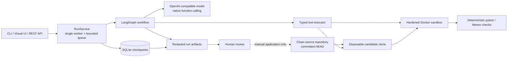

# Repo Maintainer Agent

[简体中文](README.zh-CN.md) | [Demo](docs/DEMO.md) | [Chinese user guide](docs/USER_GUIDE.zh-CN.md) | [Benchmark protocol](benchmarks/README.md)

Repo Maintainer Agent turns a natural-language bug report into a reviewed,
verified patch for a local Git repository. It plans with an OpenAI-compatible
model, pauses for approval, edits only a disposable candidate clone, verifies
the result in hardened Docker containers, and publishes durable artifacts for a
human to inspect. It never applies, commits, or pushes the patch to the source
repository.

The repository includes a Typer CLI, a loopback visual workspace, an
authenticated FastAPI service, resumable LangGraph orchestration, Python and
Maven sandboxes, and a frozen evaluation suite. Locked v1 model results are
published below and in `benchmarks/results/v1`; the sanitized `results.jsonl`
is the source of truth.

## What it does

- Accepts a clean, committed local Git repository and a natural-language
  maintenance task.
- Builds a bounded repository map and lets the model use seven typed tools:
  `list_files`, `read_file`, `read_files`, `search_code`, `apply_patch`,
  `get_diff`, and `finish`.
- Produces a structured change plan and waits for explicit approval unless
  auto-approval was requested.
- Applies model patches only in a run-owned candidate clone, then runs
  deterministic `pytest` or Maven checks in Docker.
- Allows at most one verification repair. Independent review is one response;
  rejection is terminal and preserves the candidate for inspection.
- Enforces non-borrowable model budgets of 4,000 tokens for planning, 23,500
  across implementation and repair, and 2,500 for review (30,000 total).
- Checkpoints every workflow boundary in SQLite so an interrupted run can
  resume without intentionally repeating completed side effects.
- Publishes `patch.diff`, `report.md`, `run.json`, `trace.jsonl`, and bounded
  check logs for human review.

The explicit `demo` provider is key-free and read-only. Missing or incompatible
model configuration fails clearly; it never falls back to fabricated model
output.

## Architecture



The fixed maintenance path is:

```text
prepare -> baseline_check -> inspect_and_plan -> approval -> implement
        -> verify -> repair (at most 1) -> review -> finalize
```

Planning is read-only. Verification is deterministic and cannot be skipped by
the model. A final `succeeded` state means the workflow completed its configured
checks and review; it is not a substitute for independent benchmark scoring or
human acceptance of the patch.

## Supported repository profiles

The maintained repository must be a clean Git worktree with at least one
commit. Only committed content is copied into the candidate workspace.

| Profile | Supported shape |
|---|---|
| Python | Python 3.11, `pytest`, one root project; optional, explicitly authorized dependency bootstrap from a root `requirements.txt` or PEP 621 metadata |
| Maven | One root `jar` module, Java 17 or 21, Maven 3.9, pinned Surefire/JUnit configuration |

Mixed Python/Maven layouts, Gradle, nested Maven modules, Git submodules, Git
LFS, repository symlinks/reparse points, custom Maven repositories, build
extensions, and dirty source worktrees are rejected. See the policy errors and
check artifacts for the exact reason when a repository is outside this scope.

## Prerequisites

The supplied setup scripts target Windows with PowerShell and Docker Desktop:

- Windows with WSL2 and Docker Desktop using Linux containers
- PowerShell 5.1 or later
- Python 3.11 or later and Git on the host
- at least 4 GB of memory available to Docker

The Python package and CI also run on Linux with a compatible Docker Engine.
Docker Desktop remains opt-in at login. Project scripts do not edit
`.wslconfig`, registry mirrors, proxy settings, or invoke global Docker cleanup.

## Install and verify

From the repository root in PowerShell:

```powershell
./scripts/start-docker.ps1
./scripts/build-sandboxes.ps1
./scripts/verify-docker.ps1
py -3.11 -m pip install -e ".[dev]"
python -m pytest
```

The sandbox images are:

- `repo-agent-python:0.1`: Python 3.11, pytest, Git, and ripgrep
- `repo-agent-maven:0.1`: Eclipse Temurin JDK 21, Maven 3.9, Git, and ripgrep

| Sandbox | Immutable base image |
|---|---|
| Python | `python:3.11.16-slim-bookworm@sha256:528257d48c1da0dcecc2e725d1ae34498d60c965f1241e39cd6a85a8859bdf84` |
| Maven | `maven:3.9.16-eclipse-temurin-21-noble@sha256:8f6ac126f7810bb5549c4cd122d2bf0e9cda5bdeb0838aa928f09e779fd8bef8` |

Their Dockerfiles pin immutable base-image digests. Local build metadata is
recorded in `docker/image-lock.json`; CI validates the Dockerfiles and runtime
contract without assuming a workstation-specific final image ID.

## Quick start without a model key

Run the read-only inspection flow against this repository:

```powershell
repo-agent run `
  --repo . `
  --task "Inspect repository status and TODO markers" `
  --provider demo `
  --format json
```

Or launch the visual workspace:

```powershell
repo-agent serve --repo . --open
```

Open `http://127.0.0.1:8765/` if the browser does not open automatically, then
select **Read-only demo**. The repository path and sandbox image are fixed when
the server starts; the browser cannot submit another host path or an arbitrary
image.

## Configure a model

The model client requires native function calling through either the Responses
API or Chat Completions. Set these process environment variables using your
organization's secret-injection mechanism:

```text
REPO_AGENT_API_KEY
REPO_AGENT_BASE_URL
REPO_AGENT_MODEL
```

Do not commit a key, place it in a task file, pass it in a command-line
argument, or mount it into a sandbox. Verify connectivity before a real task:

```powershell
repo-agent doctor --allow-remote-model --format json
```

Non-loopback model endpoints must use HTTPS and require
`--allow-remote-model`. That authorization matters: task text and the code
fragments selected by tool calls can be sent to the configured provider.

### Saved Windows DeepSeek configuration

For the official DeepSeek API at `https://api.deepseek.com`, the helper can
discover models, run the doctor probe, and save the key, Base URL, and model as
one Windows DPAPI CurrentUser-encrypted document. The configured model is
`deepseek-v4-pro`:

```powershell
./scripts/start-relay.ps1 -Reconfigure -ConfigureOnly -Model deepseek-v4-pro
./scripts/start-relay.ps1 -Repository D:\path\to\clean-repository -OpenBrowser
```

The saved file is `%LOCALAPPDATA%\RepoMaintainerAgent\config\relay.json`. Later
starts load it without prompting. Use `-Verify` for a new paid handshake and
`-Reconfigure -ConfigureOnly` to rotate the configuration. The helper restores
the process environment when the launched UI exits. DPAPI protects data at
rest for the current Windows user; it does not protect against code already
running as that user or an administrator.

## Run a maintenance task

With model variables available in the current process:

```powershell
repo-agent run `
  --repo D:\path\to\clean-repository `
  --task "Fix the parser boundary bug and add a regression test" `
  --allow-remote-model
```

Read a UTF-8 task file and approve the generated plan automatically:

```powershell
repo-agent run `
  --repo D:\path\to\clean-repository `
  --task-file .\issue.txt `
  --yes `
  --allow-remote-model `
  --format json
```

Add `--allow-bootstrap` only after reviewing the repository's declared
dependencies. Bootstrap uses a registered, bounded command with bridge
networking; verification runs in a separate container with `network=none`.

Manage durable runs with:

```powershell
repo-agent show RUN_ID --format json
repo-agent resume RUN_ID --approve --reason "Plan reviewed"
repo-agent resume RUN_ID
repo-agent cancel RUN_ID
```

`resume` without a decision is for an `interrupted` run. A data directory can
be owned by only one live `RunService`; while the UI or API is running, make
decisions through that service. The read-only `show` command remains safe.

## Visual workspace and REST API

The loopback UI shows readiness, repository identity, sandbox policy, plan
approval, checks, metrics, trace events, and downloadable artifacts:

```powershell
repo-agent serve --repo D:\path\to\clean-repository --port 8765 --open
```

For automation, start the authenticated FastAPI surface:

```powershell
$env:REPO_AGENT_BEARER_TOKEN = "replace-with-a-local-secret"
$repoRoot = (Get-Location).Path
$allowedRoot = Split-Path -Parent $repoRoot
repo-agent serve --api `
  --repo $repoRoot `
  --allowed-root $allowedRoot `
  --host 127.0.0.1 `
  --port 8080
```

All run and artifact routes require `Authorization: Bearer ...`; only
`/healthz` and `/readyz` are unauthenticated. The main routes are:

| Method and path | Purpose |
|---|---|
| `POST /v1/runs` | Queue a run and return its ID |
| `GET /v1/runs/{id}` | Read status, plan, checks, metrics, and artifact links |
| `POST /v1/runs/{id}/decision` | Approve or reject a plan |
| `POST /v1/runs/{id}/resume` | Resume an interrupted run |
| `POST /v1/runs/{id}/cancel` | Request cancellation and sandbox cleanup |
| `GET /v1/runs/{id}/artifacts/{kind}` | Download a fixed run artifact |

API repository paths must be absolute and stay below a configured
`--allowed-root`.

## Artifacts and states

By default, Windows stores durable state below `%LOCALAPPDATA%\repo-agent`.
Override it with `--data-dir` or `REPO_AGENT_DATA_DIR`. Each run owns:

| Artifact | Contents |
|---|---|
| `patch.diff` | Candidate unified diff for manual review/application |
| `report.md` | Task, approved plan, checks, and risk summary |
| `run.json` | Structured run state and metrics |
| `trace.jsonl` | Append-only, redacted workflow events |
| `checks/*.log` | Bounded baseline and verification output |

Public states are `queued`, `planning`, `awaiting_approval`, `running`,
`interrupted`, `succeeded`, `unverified`, `failed`, `cancelled`,
`policy_denied`, and `rejected`.

## Security boundary

Every verification container uses this contract:

```text
--init --pull never --restart no
--network none --read-only --user 10001:10001
--cpus 2 --memory 4g --memory-swap 4g --pids-limit 256
--cap-drop ALL --security-opt no-new-privileges
--tmpfs /tmp:rw,nosuid,nodev,size=256m,mode=1777
```

Additional boundaries:

- The source repository is never mounted read-write and is never automatically
  patched, committed, or pushed.
- The model has no shell, arbitrary command, Git push, host network, Docker
  socket, SSH, or credential tool.
- Absolute paths, traversal, `.git`, credential-like paths, symlink/reparse
  escapes, hard-linked targets, binary patches, renames, submodules, and mode
  changes are rejected.
- Host home, SSH configuration, model credentials, and the Docker socket are
  never mounted into tool or check containers.
- Logs and structured artifacts are bounded and redacted. `patch.diff` is kept
  byte-for-byte applicable; a configured secret or high-confidence credential
  pattern makes patch persistence fail closed instead of rewriting the diff.
  Containers are named/labeled per run and cleanup targets exact IDs; no global
  prune is used.

The model provider is still an external trust boundary. Only use a remote
endpoint for repositories whose relevant code and task text may be disclosed to
that provider.

## Measured benchmark results (v1)

The locked 44-job evaluation completed with `gpt-5.6-sol` on 2026-09-12
(UTC+8). The published v1 table and aggregate statistics are recomputable from
[`results.jsonl`](benchmarks/results/v1/results.jsonl), whose SHA-256 is
`1f083cdf6ce1630ec50da47cadf3b16a7e628c09c23f10e697bc407549579761`.
The relay's token prices were not independently verified, so cost is not
reported.

The primary comparison uses only trial 1:

| Variant | Solved | Python | Java | Agent p50 | Agent p95 |
|---|---:|---:|---:|---:|---:|
| `baseline` | 10/12 | 6/6 | 4/6 | 72.1 s | 370.4 s |
| `no-review` | 3/12 | 3/6 | 0/6 | 347.4 s | 693.6 s |
| `full` | 1/12 | 1/6 | 0/6 | 238.1 s | 633.0 s |

This is a negative result for the complete architecture on the locked suite.
`full` missed the predeclared quality bar of 8/12 with at least 4/6 in each
language. It solved nine fewer tasks than `baseline` and two fewer than
`no-review`, so the results do not support either the complete-architecture or
independent-review benefit claims.

The immutable v1 scorer missed pytest `SUBFAILED` output for the trial-1
`full` `py-bugfix-005` candidate. The corrected interpretation is 2/12 overall
and 2/6 Python after applying the fixed attribution rule to the preserved
scoring evidence; those corrected figures are intentionally not written into
the immutable JSONL. They still miss every release threshold. See
[`benchmarks/ERRATA.md`](benchmarks/ERRATA.md); the three published v1 result
files and their digest are unchanged.

Across all 44 runs, all evaluations completed and 14 were solved. Agent latency
was 120.5 s p50 and 641.8 s p95, so the eight-minute p95 target was missed. The
30 failures were 29 `budget_exceeded` and one
`regression_not_reproduced`; no run hit the 20-minute hard timeout. Regression
tests were restored in 16/44 runs, and 118/469 tool calls returned errors
(25.16%). Complete usage reporting recorded 1,317,446 tokens: 1,222,140 input
(including 54,656 cached input) and 95,306 output. Cost remains `null` with
`price_source=unavailable`.

The four repeated `full` tasks produced `0/3` for `py-bugfix-003`, `1/3` for
`py-bugfix-004`, `0/3` for `java-bugfix-003`, and `0/3` for
`java-bugfix-006`. Three are consistent failures and one is inconsistent; none
demonstrates stable success. See
[`report.json`](benchmarks/results/v1/report.json) and
[`failure-analysis.json`](benchmarks/results/v1/failure-analysis.json) for the
derived aggregates and failed-job inventory. These measurements characterize
this model, budget, and locked suite only.

## Evaluation and reproduction

The frozen suite contains six Python and six Java bug-fix tasks. Candidate
Agents see a buggy setup, its public tests, and `issue.md`; independent scoring
withholds `hidden_tests`, `gold.patch`, and expected failure signatures. A
candidate is not solved merely because its workflow status is `succeeded`.

Before a new formal run, tune only against the four non-formal development
fixtures. With saved Windows relay configuration, the restricted helper runs
the fixed four-task `full` command and writes to a fresh ignored directory:

```powershell
./scripts/start-relay.ps1 -Evaluate
```

The helper exits successfully only when at least 3/4 tasks are solved, every
task stays within budget, and `actionable_tool_error_rate <= 5%`.

After freezing the code, prompt, model, and budgets, the separate restricted
formal acceptance entry point runs only the twelve-task `full` trial 1 and
writes to a fresh `evaluation-results/formal-v1-regression-acceptance/`
directory:

```powershell
./scripts/start-relay.ps1 -FormalEvaluate
```

It succeeds only at `>=8/12`, with Python and Java each at `>=4/6`, complete
per-task usage within 30,000 tokens, no timeouts or budget failures, and p95
latency at most 480 seconds. This is a v1 regression acceptance run, not a new
holdout or a 44-job matrix rerun; it never writes `benchmarks/results/v1`.

The generic CLI accepts that development suite only in single-variant mode;
matrix, canary, shard, and merge modes remain restricted to the formal suite.

Validate suite locks without Docker:

```powershell
python ./benchmarks/validate.py --structure-only
$projectParent = Split-Path -Parent (Get-Location).Path
$evaluationRoot = Join-Path $projectParent ".repo-agent-eval-day7-v1"
repo-agent eval `
  --matrix-only `
  --output-dir $evaluationRoot `
  --format json
```

`--matrix-only` performs no model call and atomically writes the reviewed
44-job contract to `$evaluationRoot\matrix.json` before formal execution.
Keep this durable state root outside the Git repository: it contains canary
state, candidate workspaces, traces, patches, and scorer evidence and must not
be committed.

Validate complete fixture lifecycles, then run the offline Docker/security
acceptance:

```powershell
python ./benchmarks/validate.py --allow-bootstrap-network
python ./scripts/smoke-day6.py
```

A model-backed evaluation requires the same explicit remote-model and bootstrap
authorizations as a normal run. First run a three-variant canary that is kept
outside the formal result set:

```powershell
repo-agent eval `
  --canary --execute `
  --allow-remote-model `
  --allow-bootstrap `
  --workers 2 `
  --output-dir $evaluationRoot `
  --format json
```

Then run the five stable shards sequentially. Each shard uses at most two
workers internally, and rerunning a shard resumes its completed jobs:

```powershell
0..4 | ForEach-Object {
  repo-agent eval `
    --matrix --execute `
    --shard-index $_ --shard-count 5 --workers 2 `
    --allow-remote-model --allow-bootstrap `
    --output-dir $evaluationRoot `
    --format json
  if ($LASTEXITCODE -ne 0) { throw "Evaluation shard $_ failed." }
}

repo-agent eval `
  --merge `
  --output-dir $evaluationRoot `
  --report-dir .\benchmarks\results\v1 `
  --format json
```

Merge rejects missing, duplicate, misplaced, or incompatible jobs. On success,
only the three sanitized files `results.jsonl`, `report.json`, and
`failure-analysis.json` belong in `benchmarks/results/v1`; never copy private
state, workspaces, traces, or machine-local paths into Git. The report is
recomputed after reading the exact 44-line JSONL back from disk. Omit token
price options when no verified price source exists:
input, cached-input, output, and total token usage are still recorded while
`cost_usd` remains `null` and `price_source` is `unavailable`. See
[benchmarks/README.md](benchmarks/README.md) for the scorer boundary, locked
matrix, resume rules, and claims policy.

## Development checks

Run the same quality gates used by CI:

```powershell
ruff check src tests scripts benchmarks
mypy src/repo_agent
python -m pytest --cov=repo_agent --cov-report=term-missing --cov-fail-under=80
python ./benchmarks/validate.py --structure-only
```

Real-container smoke checks are intentionally separate because they require the
two local sandbox images:

```powershell
python ./scripts/smoke-day1.py
python ./scripts/smoke-day2.py
python ./scripts/smoke-day3.py
python ./scripts/smoke-day6.py
```

For a reproducible walkthrough, follow [docs/DEMO.md](docs/DEMO.md). Detailed
Chinese operating notes are in
[docs/USER_GUIDE.zh-CN.md](docs/USER_GUIDE.zh-CN.md). The failure-injection and
boundary-test matrix is documented in
[docs/EXTREME_TESTING.zh-CN.md](docs/EXTREME_TESTING.zh-CN.md).

## License

Released under the [MIT License](LICENSE).
