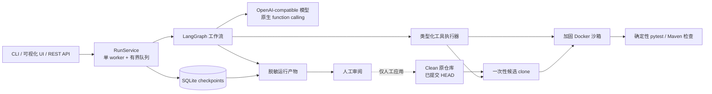

# Repo Maintainer Agent

[English](README.md) | [演示流程](docs/DEMO.md) | [详细用户说明](docs/USER_GUIDE.zh-CN.md) | [评测协议](benchmarks/README.md)

Repo Maintainer Agent 把自然语言 Bug 描述转换为可审阅、经过验证的本地 Git
仓库补丁。它使用 OpenAI-compatible 模型生成计划，等待人工批准，只在一次性候选
clone 中修改代码，再用加固的 Docker 容器验证结果，最后交付持久化产物供人工
检查。它不会把补丁自动应用、提交或推送到原仓库。

项目包含 Typer CLI、本机可视化工作台、带认证的 FastAPI 服务、可恢复的
LangGraph 工作流、Python/Maven 沙箱和冻结评测集。锁定的 v1 模型实测结果见下文
及 `benchmarks/results/v1`；脱敏后的 `results.jsonl` 是唯一数据源。

## 核心能力

- 接收一个 clean、已有提交的 Git 仓库和自然语言维护任务。
- 构建有界仓库地图，并只向模型提供七个类型化工具：`list_files`、
  `read_file`、`read_files`、`search_code`、`apply_patch`、`get_diff` 和
  `finish`。
- 生成结构化修改计划；除非显式选择自动批准，否则等待人工审批。
- 只在当前运行拥有的候选 clone 中应用模型补丁，并在 Docker 中运行确定性的
  `pytest` 或 Maven 检查。
- 验证失败最多修复一次；独立审查固定为一次模型响应，拒绝后保留候选并终止。
- 模型预算按阶段固定且不可借用：规划 4,000 token，实现与修复合计 23,500，
  审查 2,500，总上限 30,000。
- 在 SQLite 中记录每个工作流边界；中断后可恢复，且不会主动重复已完成并已记录
  的副作用。
- 生成 `patch.diff`、`report.md`、`run.json`、`trace.jsonl` 和有界测试日志。

显式选择的 `demo` provider 无需 Key，但仅支持只读检查。模型配置缺失或接口不
兼容时会明确失败，不会以伪造模型输出降级运行。

## 架构



固定维护路径如下：

```text
prepare -> baseline_check -> inspect_and_plan -> approval -> implement
        -> verify -> repair（最多 1 次）-> review -> finalize
```

规划阶段只读，模型不能跳过确定性验证。最终状态 `succeeded` 表示工作流完成了
已配置的检查与审查，不等于独立 benchmark 判定通过，也不能替代人工接受补丁。

## 支持的仓库类型

待维护仓库必须是 clean Git worktree，且至少有一次提交。候选工作区只复制已提交
内容。

| Profile | 支持范围 |
|---|---|
| Python | Python 3.11、`pytest`、单个根项目；可从根目录 `requirements.txt` 或 PEP 621 元数据执行需显式授权的依赖 bootstrap |
| Maven | 单个根 `jar` 模块、Java 17 或 21、Maven 3.9、固定的 Surefire/JUnit 配置 |

混合 Python/Maven 布局、Gradle、嵌套 Maven 模块、Git submodule、Git LFS、仓库
symlink/reparse point、自定义 Maven 仓库、构建扩展以及 dirty worktree 会被拒绝。
仓库超出范围时，以 policy 错误和 check 产物中的具体原因作为诊断依据。

## 环境要求

仓库提供的环境脚本面向 Windows、PowerShell 和 Docker Desktop：

- Windows、WSL2、Docker Desktop Linux containers
- PowerShell 5.1 或更高版本
- 宿主 Python 3.11 或更高版本、Git
- Docker 至少可用 4 GB 内存

Python 包和 CI 也可在带兼容 Docker Engine 的 Linux 上运行。Docker Desktop 保持
按需启动；脚本不会修改 `.wslconfig`、registry mirror、代理设置，也不会执行全局
Docker 清理。

## 安装与环境验收

在项目根目录打开 PowerShell：

```powershell
./scripts/start-docker.ps1
./scripts/build-sandboxes.ps1
./scripts/verify-docker.ps1
py -3.11 -m pip install -e ".[dev]"
python -m pytest
```

项目使用两个沙箱镜像：

- `repo-agent-python:0.1`：Python 3.11、pytest、Git、ripgrep
- `repo-agent-maven:0.1`：Eclipse Temurin JDK 21、Maven 3.9、Git、ripgrep

| 沙箱 | 固定基础镜像 |
|---|---|
| Python | `python:3.11.16-slim-bookworm@sha256:528257d48c1da0dcecc2e725d1ae34498d60c965f1241e39cd6a85a8859bdf84` |
| Maven | `maven:3.9.16-eclipse-temurin-21-noble@sha256:8f6ac126f7810bb5549c4cd122d2bf0e9cda5bdeb0838aa928f09e779fd8bef8` |

两个 Dockerfile 都固定了基础镜像 digest。本机构建元数据记录在
`docker/image-lock.json`；CI 验证 Dockerfile 与运行时安全合同，不依赖某台机器
特有的最终 image ID。

## 无 Key 快速体验

先对本仓库运行只读检查：

```powershell
repo-agent run `
  --repo . `
  --task "检查仓库状态和 TODO 标记" `
  --provider demo `
  --format json
```

也可以启动可视化工作台：

```powershell
repo-agent serve --repo . --open
```

浏览器未自动打开时访问 `http://127.0.0.1:8765/`，选择 **Read-only demo**。
服务启动时已经固定仓库路径和沙箱镜像，网页不能提交其他宿主路径或任意镜像。

## 配置模型

模型客户端要求 Responses API 或 Chat Completions 提供原生 function calling。
请通过组织认可的密钥注入方式设置以下进程环境变量：

```text
REPO_AGENT_API_KEY
REPO_AGENT_BASE_URL
REPO_AGENT_MODEL
```

不要把 Key 提交进仓库、写进任务文件、放在命令行参数中，或挂载到沙箱。真实任务
前先检查连通性：

```powershell
repo-agent doctor --allow-remote-model --format json
```

非 loopback 模型地址必须使用 HTTPS，并要求显式传入 `--allow-remote-model`。
这是数据出站授权：任务文本和工具为完成任务选取的代码片段可能被发送给所配置的
模型服务。

### 保存 Windows DeepSeek 配置

对于 DeepSeek 官方 API `https://api.deepseek.com`，辅助脚本可以发现可用模型、
执行 doctor 探针，并把 Key、Base URL、模型作为一个整体使用 Windows DPAPI
CurrentUser 加密保存。当前配置模型为 `deepseek-v4-pro`：

```powershell
./scripts/start-relay.ps1 -Reconfigure -ConfigureOnly -Model deepseek-v4-pro
./scripts/start-relay.ps1 -Repository D:\path\to\clean-repository -OpenBrowser
```

配置保存到 `%LOCALAPPDATA%\RepoMaintainerAgent\config\relay.json`，以后启动无需再次
输入。使用 `-Verify` 可重新执行一次会产生少量调用的握手；使用
`-Reconfigure -ConfigureOnly` 轮换 Key 或模型。辅助脚本启动的 UI 退出后，脚本会
恢复进程环境。DPAPI 保护当前 Windows 用户的静态配置，但不能抵御已经以同一用户
运行的恶意程序或管理员。

## 运行维护任务

当前进程已经具备模型环境变量时：

```powershell
repo-agent run `
  --repo D:\path\to\clean-repository `
  --task "修复解析器边界错误并增加回归测试" `
  --allow-remote-model
```

也可从 UTF-8 文件读取任务并自动批准计划：

```powershell
repo-agent run `
  --repo D:\path\to\clean-repository `
  --task-file .\issue.txt `
  --yes `
  --allow-remote-model `
  --format json
```

仅在审核过仓库声明的依赖后增加 `--allow-bootstrap`。bootstrap 使用注册且有界的
固定命令和 `bridge` 网络；后续验证在另一个 `network=none` 容器中运行。

持久化任务管理命令：

```powershell
repo-agent show RUN_ID --format json
repo-agent resume RUN_ID --approve --reason "已审核计划"
repo-agent resume RUN_ID
repo-agent cancel RUN_ID
```

不带 decision 的 `resume` 只用于 `interrupted` 状态。一个 data directory 同时只能
被一个活跃 `RunService` 拥有；UI 或 API 运行时，应通过该服务审批、恢复、取消。
只读的 `show` 命令仍可使用。

## 可视化工作台与 REST API

本机工作台展示环境就绪状态、仓库身份、安全策略、计划审批、检查结果、metrics、
trace 以及可下载产物：

```powershell
repo-agent serve --repo D:\path\to\clean-repository --port 8765 --open
```

需要程序化接入时，启动带 Bearer 认证的 FastAPI 服务：

```powershell
$env:REPO_AGENT_BEARER_TOKEN = "replace-with-a-local-secret"
$repoRoot = (Get-Location).Path
$allowedRoot = Split-Path -Parent $repoRoot
repo-agent serve --api `
  --repo $repoRoot `
  --allowed-root $allowedRoot `
  --host 127.0.0.1 `
  --port 8080
```

除 `/healthz` 和 `/readyz` 外，所有 run 与 artifact 路由都要求
`Authorization: Bearer ...`。

| 方法与路径 | 用途 |
|---|---|
| `POST /v1/runs` | 将任务加入队列并返回 ID |
| `GET /v1/runs/{id}` | 查询状态、计划、检查、metrics 和产物链接 |
| `POST /v1/runs/{id}/decision` | 批准或拒绝计划 |
| `POST /v1/runs/{id}/resume` | 恢复中断任务 |
| `POST /v1/runs/{id}/cancel` | 请求取消并回收活跃沙箱 |
| `GET /v1/runs/{id}/artifacts/{kind}` | 下载固定运行产物 |

API 中的仓库路径必须是绝对路径，并位于配置的 `--allowed-root` 之下。

## 运行状态与产物

Windows 默认把持久化数据保存到 `%LOCALAPPDATA%\repo-agent`，可用 `--data-dir` 或
`REPO_AGENT_DATA_DIR` 覆盖。每次运行拥有：

| 产物 | 内容 |
|---|---|
| `patch.diff` | 供人工审阅和应用的候选 unified diff |
| `report.md` | 任务、批准计划、检查与风险摘要 |
| `run.json` | 结构化运行状态与 metrics |
| `trace.jsonl` | 追加式、已脱敏的工作流事件 |
| `checks/*.log` | 有界的 baseline 和 verify 输出 |

公开状态包括 `queued`、`planning`、`awaiting_approval`、`running`、
`interrupted`、`succeeded`、`unverified`、`failed`、`cancelled`、
`policy_denied` 和 `rejected`。

## 安全边界

每个验证容器使用同一安全合同：

```text
--init --pull never --restart no
--network none --read-only --user 10001:10001
--cpus 2 --memory 4g --memory-swap 4g --pids-limit 256
--cap-drop ALL --security-opt no-new-privileges
--tmpfs /tmp:rw,nosuid,nodev,size=256m,mode=1777
```

其他边界包括：

- 原仓库永远不会以读写方式挂载，也不会被自动 apply、commit 或 push。
- 模型没有 shell、任意命令、Git push、宿主网络、Docker socket、SSH 或凭据工具。
- 绝对路径、路径穿越、`.git`、疑似凭据路径、symlink/reparse 逃逸、hardlink
  目标、二进制补丁、rename、submodule 和 mode change 均被拒绝。
- 宿主 HOME、SSH 配置、模型凭据、Docker socket 不会挂载进工具或验证容器。
- 日志和结构化产物有大小限制并进行脱敏；`patch.diff` 为保持可应用性按原字节
  保存，若命中已配置密钥或高置信凭据格式则直接拒绝持久化，不会改写 diff。
  容器按 run 命名/打标签，仅按精确 ID 回收，不运行全局 prune。

模型服务本身仍是外部信任边界。只有当仓库允许把相关代码和任务文本发送给该服务
时，才应授权远程模型。

## v1 实测结果

锁定的 44-job 评测已于 2026-09-12（UTC+8）使用 `gpt-5.6-sol` 完成。下列已发布
v1 表格和汇总统计均可从 [`results.jsonl`](benchmarks/results/v1/results.jsonl)
重新计算；该文件
SHA-256 为
`1f083cdf6ce1630ec50da47cadf3b16a7e628c09c23f10e697bc407549579761`。
中转站 token 单价未经独立核实，因此不报告费用。

主比较只使用 trial 1：

| Variant | 解决数 | Python | Java | Agent p50 | Agent p95 |
|---|---:|---:|---:|---:|---:|
| `baseline` | 10/12 | 6/6 | 4/6 | 72.1 秒 | 370.4 秒 |
| `no-review` | 3/12 | 3/6 | 0/6 | 347.4 秒 | 693.6 秒 |
| `full` | 1/12 | 1/6 | 0/6 | 238.1 秒 | 633.0 秒 |

这是完整架构在该锁定评测集上的负面结果。`full` 未达到预声明的 8/12 总门槛，
Python 和 Java 也未分别达到 4/6；它比 `baseline` 少解决 9 题，比
`no-review` 少解决 2 题。因此，本次结果不支持“完整架构提升成功率”或“独立
review 带来收益”这两个正向结论。

不可变的 v1 scorer 没有识别 trial-1 `full` 中 `py-bugfix-005` 的 pytest
`SUBFAILED` 输出。对保留的 scoring evidence 应用修正后的归因规则，该结果等价于
总计 2/12、Python 2/6；这些修正数字不会回写不可变 JSONL，且仍未达到任一发布
门槛。详情见 [`benchmarks/ERRATA.md`](benchmarks/ERRATA.md)；v1 的
三个发布结果文件及其摘要值均未改写。

全部 44 次运行均完成评测，其中 14 次解决任务。Agent 延迟为 p50 120.5 秒、
p95 641.8 秒，未达到 p95 不超过 8 分钟的目标。30 个失败包括 29 个
`budget_exceeded` 和 1 个 `regression_not_reproduced`；没有运行触发 20 分钟硬
超时。16/44 次运行成功恢复回归测试，469 次工具调用中有 118 次返回错误
（25.16%）。完整 usage 记录为 1,317,446 tokens：1,222,140 input（其中
54,656 cached input）和 95,306 output。费用保持 `null`，
`price_source=unavailable`。

四个 `full` 重复任务的结果分别为：`py-bugfix-003` 为 0/3、
`py-bugfix-004` 为 1/3、`java-bugfix-003` 为 0/3、`java-bugfix-006` 为
0/3。三个任务是结果一致的失败，一个任务结果不一致，没有任务表现出稳定成功。
派生汇总和失败任务清单见
[`report.json`](benchmarks/results/v1/report.json) 与
[`failure-analysis.json`](benchmarks/results/v1/failure-analysis.json)。这些实测
只描述当前模型、预算和锁定评测集，不能外推到其他仓库。

## 评测与复现

冻结评测集包含 6 个 Python 和 6 个 Java bug-fix 任务。候选 Agent 只能看到带 Bug
的 setup、公开测试和 `issue.md`；独立 scorer 不向 Agent 暴露 `hidden_tests`、
`gold.patch` 或预期失败签名。不能直接用工作流 `succeeded` 判断题目通过。

正式运行前只使用 4 个非正式 development fixture 调优。已保存 Windows 中转站
配置时，以下受限入口会运行固定的四题 `full` 命令，并写入新的忽略目录：

```powershell
./scripts/start-relay.ps1 -Evaluate
```

仅当至少解决 3/4、四项任务均未超预算且
`actionable_tool_error_rate <= 5%` 时，该入口才以成功状态退出。

冻结代码、prompt、模型和预算后，使用另一个受限入口只运行正式 12 题的 `full`
trial 1：

```powershell
./scripts/start-relay.ps1 -FormalEvaluate
```

每次结果写入新的
`evaluation-results/formal-v1-regression-acceptance/` 子目录。只有总计至少
8/12、Python 与 Java 各至少 4/6、每题 usage 完整且不超过 30,000 token、无超时
或预算失败、p95 不超过 480 秒时才成功。该结果只能标记为 v1 regression
acceptance，不是新的 holdout，也不会运行 44-job matrix 或写入
`benchmarks/results/v1`。

通用 CLI 仅允许在 single-variant 模式使用该 development suite；matrix、canary、
shard 和 merge 仍只接受正式套件。

不使用 Docker 检查结构和内容锁：

```powershell
python ./benchmarks/validate.py --structure-only
$projectParent = Split-Path -Parent (Get-Location).Path
$evaluationRoot = Join-Path $projectParent ".repo-agent-eval-day7-v1"
repo-agent eval `
  --matrix-only `
  --output-dir $evaluationRoot `
  --format json
```

`--matrix-only` 不调用模型，并在正式执行前把审核过的 44-job 合同原子写入
`$evaluationRoot\matrix.json`。这个持久化 state 目录必须位于 Git 仓库外：其中包含
canary 状态、候选 workspace、trace、patch 和 scorer evidence，不得提交。

验证完整 fixture 生命周期，再运行离线 Docker 与安全验收：

```powershell
python ./benchmarks/validate.py --allow-bootstrap-network
python ./scripts/smoke-day6.py
```

真实模型评测需要与普通任务相同的远程模型和 bootstrap 显式授权。先运行不计入
正式结果的三 variant canary：

```powershell
repo-agent eval `
  --canary --execute `
  --allow-remote-model `
  --allow-bootstrap `
  --workers 2 `
  --output-dir $evaluationRoot `
  --format json
```

再顺序执行 5 个稳定 shard。每个 shard 内部最多使用 2 个 worker；同一 shard 重跑
会恢复已完成 job：

```powershell
0..4 | ForEach-Object {
  repo-agent eval `
    --matrix --execute `
    --shard-index $_ --shard-count 5 --workers 2 `
    --allow-remote-model --allow-bootstrap `
    --output-dir $evaluationRoot `
    --format json
  if ($LASTEXITCODE -ne 0) { throw "Evaluation shard $_ failed." }
}

repo-agent eval `
  --merge `
  --output-dir $evaluationRoot `
  --report-dir .\benchmarks\results\v1 `
  --format json
```

merge 会拒绝缺失、重复、位置错误或元数据不一致的 job。成功后，publish directory
`benchmarks/results/v1` 只应包含脱敏后的 `results.jsonl`、`report.json` 和
`failure-analysis.json` 三个文件；不得把私有 state、workspace、trace 或本机绝对
路径复制进 Git。报告会在重新读取严格 44 行的 JSONL 后计算。没有可核实价格来源时
不要传 token 单价：系统仍记录 input、cached-input、output 和 total token，
`cost_usd` 保持 `null`，`price_source` 为 `unavailable`。独立 scorer 边界、锁定
矩阵、恢复规则和结论门槛见 [benchmarks/README.md](benchmarks/README.md)。

## 开发与 CI 检查

运行和 CI 相同的质量门禁：

```powershell
ruff check src tests scripts benchmarks
mypy src/repo_agent
python -m pytest --cov=repo_agent --cov-report=term-missing --cov-fail-under=80
python ./benchmarks/validate.py --structure-only
```

真实容器 smoke 需要先构建两个沙箱镜像：

```powershell
python ./scripts/smoke-day1.py
python ./scripts/smoke-day2.py
python ./scripts/smoke-day3.py
python ./scripts/smoke-day6.py
```

完整演示流程见 [docs/DEMO.md](docs/DEMO.md)，更细的操作说明见
[docs/USER_GUIDE.zh-CN.md](docs/USER_GUIDE.zh-CN.md)，故障注入与边界测试矩阵见
[docs/EXTREME_TESTING.zh-CN.md](docs/EXTREME_TESTING.zh-CN.md)。

## 许可证

项目采用 [MIT License](LICENSE)。
